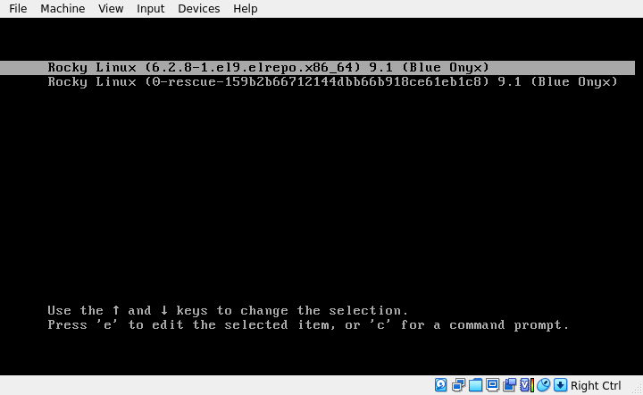
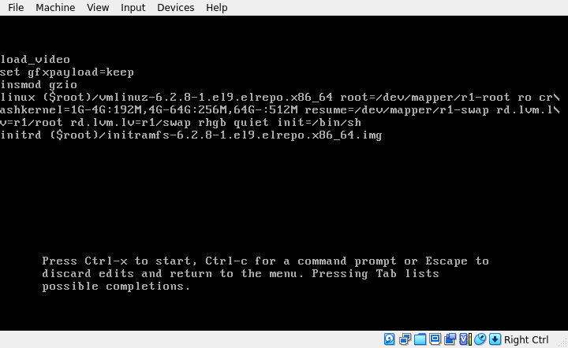
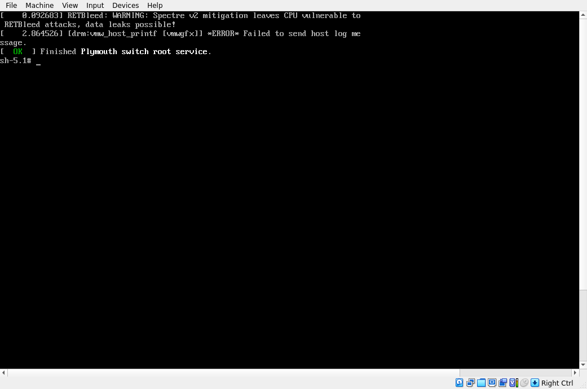
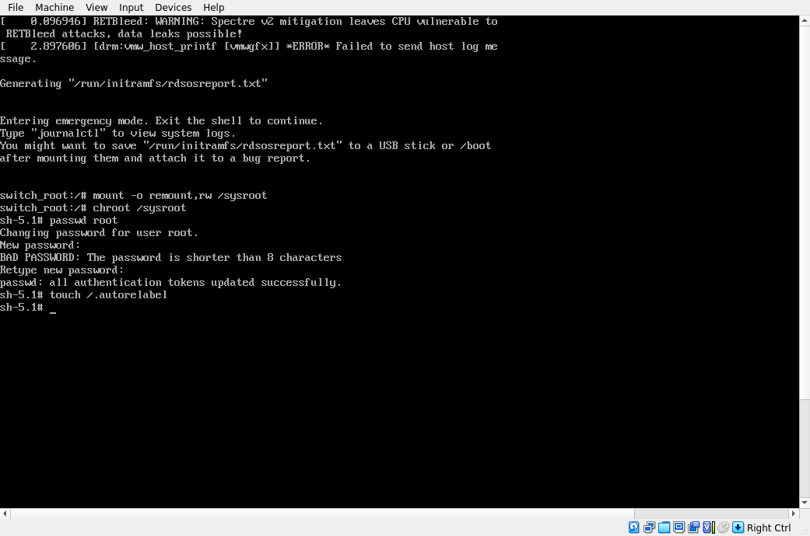
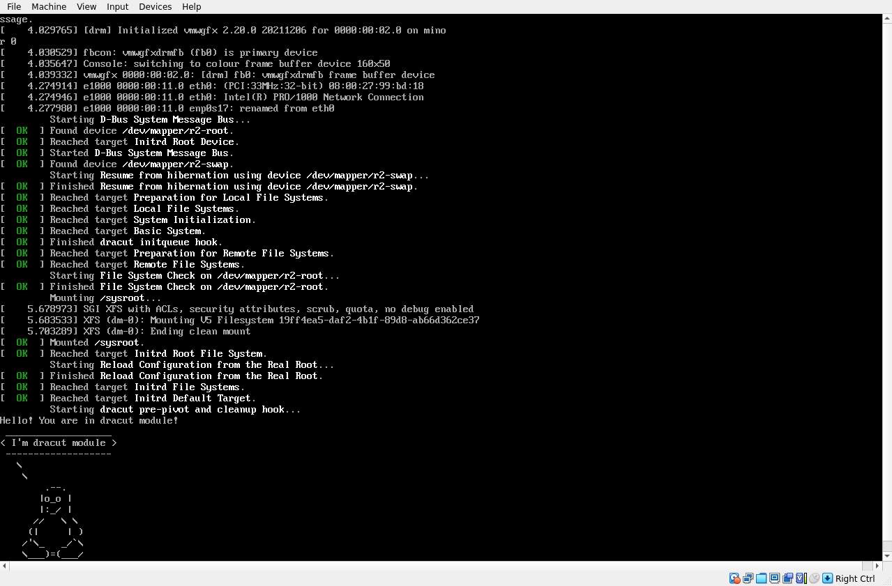

# Загрузка системы
## Попасть в систему без пароля
1. **init=/bin/sh**

На экране выбора варианта ядра нажимаем `e` и попадаем в окно с отображением параметров загрузки выбранного варианта ядра, которые можно изменить.



В конец строки, начинающейся с `linux` допишем параметр `init=/bin/sh`, добавление которого заставит ОС загрузиться сразу в shell с правами root





Теперь у нас сть доступ к системе, но для внесения каких-либо изменений в нее, необходимо перемонтировать корневую ФС, поскольку, как можно увидеть на скрине параметров загрузки ядра, указан параметр `ro` и ФС соответственно смонтировалась как Read-only. Перемонтируем ```mount -o remount,rw /```. Если в системе был включен SELinux, то для сохранения изменений после загрузки ОС в нормальном режиме, необходимо создать в корне ФС пустой файл с названием `.autorelabel`

---
2. **rd.break**

В конец строки, начинающейся с `linux` допишем параметр `rd.break`. Попадаем в emergency режим. В данном случае корневая ФС ОС смонтирована по пути `/sysroot`. Для дальнейшей работы по внесению каких-либо изменений в ОС, требуется аналогично перемонтировать ФС на rw и сменить корневую директорию командой `chroot /sysroot`. Если в системе был включен SELinux, то для сохранения изменений после загрузки ОС в нормальном режиме, необходимо создать в корне ФС пустой файл с названием `.autorelabel`



---
3. **rw init=/bin/sh**

Данный вариант позволяет сразу смонтировать корневую ФС в режиме Read-write. Для этого в строке начинающейся с `linux` необходимо заменить параметр `ro` на `rw init=/bin/sh` и загрузиться с данными параметрами.

## Переименовать VG в системе с LVM
Посмотрим, какие Volume group присутствуют в системе
```
[root@r9 ~]# vgs
  VG #PV #LV #SN Attr   VSize  VFree
  r1   1   2   0 wz--n- 14.62g    0
```
Переименуем VG и поправим файлы /etc/fstab, /etc/default/grub, /boot/grub2/grub.cfg, заменив старое имя
```
[root@r9 ~]# vgrename r1 r2
  Volume group "r1" successfully renamed to "r2"
[root@r9 ~]# sed -i 's/r1/r2/g' {/etc/fstab,/etc/default/grub,/boot/grub2/grub.cfg,/boot/loader/entries/*}
[root@r9 ~]# dracut -f -v
```
Добавим свой модуль при загрузке
```
[root@r9 ~]# mkdir /usr/lib/dracut/modules.d/01test
[root@r9 ~]# cp /vagrant/module-setup.sh  /usr/lib/dracut/modules.d/01test/
[root@r9 ~]# cp /vagrant/test.sh  /usr/lib/dracut/modules.d/01test/
```
Перезагрузим систему, в меню GRUB скорректируем параметры загрузки ядра, уберем `rhgb` и `quiet`.

