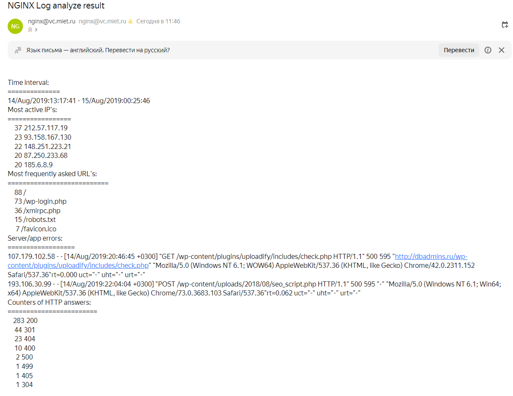

# Скрипт Bash (grep, sed, awk)
Задание:
1) Написать скрипт для CRON, который раз в час будет формировать письмо и отправлять на заданную почту.
2) Необходимая информация в письме:
- Список IP адресов (с наибольшим кол-вом запросов) с указанием кол-ва запросов c момента последнего запуска скрипта;
- Список запрашиваемых URL (с наибольшим кол-вом запросов) с указанием кол-ва запросов c момента последнего запуска скрипта;
- Ошибки веб-сервера/приложения c момента последнего запуска;
- Список всех кодов HTTP ответа с указанием их кол-ва с момента последнего запуска скрипта.
3) Скрипт должен предотвращать одновременный запуск нескольких копий, до его завершения.
4) В письме должен быть прописан обрабатываемый временной диапазон.
  
Создание задания для cron прописано и производится в provision-скрипте setup.sh. Для возможности отправки письма необходимо заполнить передаваемые аргументы в секции provision Vagrantfile корректными значениями. Ниже разберем работу непаосредственно скрипта по заданию. 
Сперва проверяем, что нет запущенного процесса выполнения скрипта и определяем перехват сигналов
```
lockfile=./lockfile
fname=$(date +%s)-tmp
if ( set -o noclobber; echo "$$" > "$lockfile") 2> /dev/null
then
trap 'echo Do not stop the script now' SIGINT
trap 'rm -f "$lockfile"; rm -f /var/tmp/$fname.*; exit $?' SIGTERM EXIT
... (тело скрипта)
else
echo "Failed to acquire lockfile: $lockfile."
echo "Hold by $(cat $lockfile)"
fi
```
Определяем обрабатывамый диапазон исходного лога (в строках и в датах), копируем нужные строки во временный файл
```
if [ ! -f ./timestamp ]; then t=null; else t=$(cat ./timestamp); fi
startline=$(grep -n -m 1 -e $t $1 | awk -F":" '{print $1}')
if [ -z "$startline" ]; then startline=1; else startline=$(($startline+1)); fi
stopline=$(wc -l $1 | awk '{print $1}')
sed -n ''$startline','$stopline'p' $1 > /var/tmp/$fname.log
startdate=$(awk 'NR == 1 {print $4}' /var/tmp/$fname.log | cut -c 2-)
stopdate=$(awk 'END{print $4}' /var/tmp/$fname.log | cut -c 2-)
```
Получаем и подсчитываем требуемые данные:

Список IP адресов (с наибольшим кол-вом запросов) с указанием кол-ва запросов c момента последнего запуска скрипта;
```
ip=$(awk '{print $1}' /var/tmp/$fname.log  | sort | uniq -c | sort -nr | grep -m 5 "")
```
Список запрашиваемых URL (с наибольшим кол-вом запросов) с указанием кол-ва запросов c момента последнего запуска скрипта;
```
url=$(grep -Eo "\s\/[^[:space:]]*\s" /var/tmp/$fname.log | sed 's/ //g' | sort | uniq -c | sort -nr | grep -m 5 "")
```
Ошибки веб-сервера/приложения c момента последнего запуска;
```
errors=$(grep -e '"\s5[0-9][0-9]\s' /var/tmp/$fname.log)
```
Список всех кодов HTTP ответа с указанием их кол-ва с момента последнего запуска скрипта.
```
codes=$(grep -Eo "\s[[:digit:]]{3}\s" /var/tmp/$fname.log | sed 's/ //g' | sort | uniq -c | sort -nr)
```
На основе полученных данных формируем тело письма и отправляем его (адреса, сервер указываются в параметрах запуска)
```
cat > /var/tmp/$fname.msg << EOF
Time interval:
============== 
$startdate - $stopdate
Most active IP's: 
=================
$ip
Most frequently asked URL's:
===========================
$url
Server/app errors: 
==================
$errors
Counters of HTTP answers:
======================
$codes
EOF
cat /var/tmp/$fname.msg | mail -s "NGINX Log analyze result" -r $1 -S mta=smtp://$2 $3
```
Записываем в файл `timestamp` последнюю обработанную дату и удаляем все временные файлы.
```
echo $stopdate > ./timestamp
rm -f /var/tmp/$fname.*
```


**PROFIT!!!**
