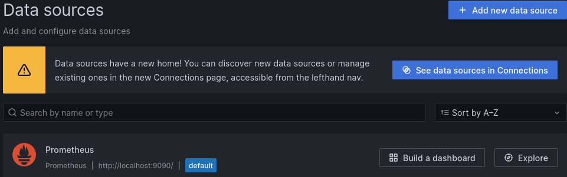
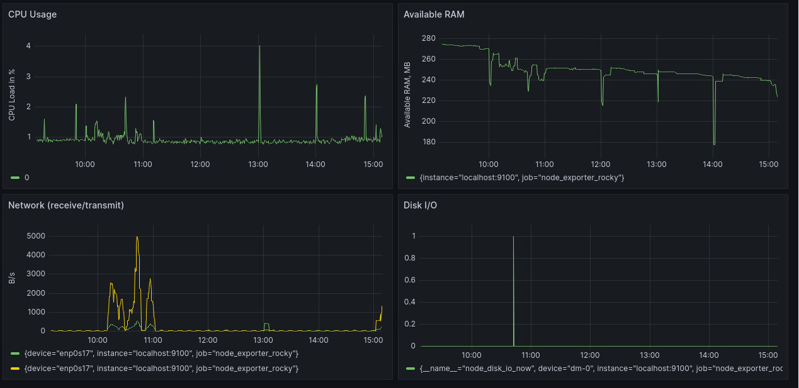
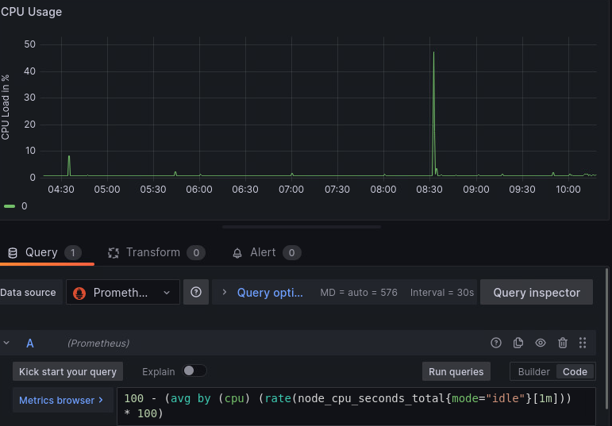
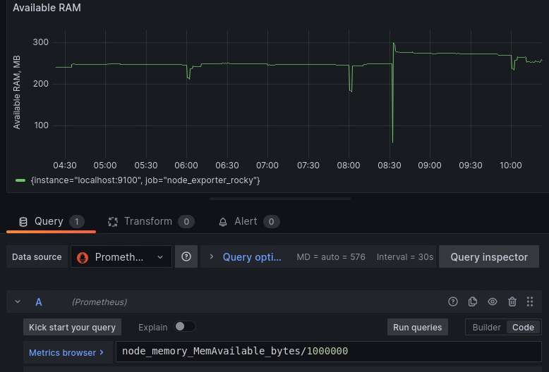
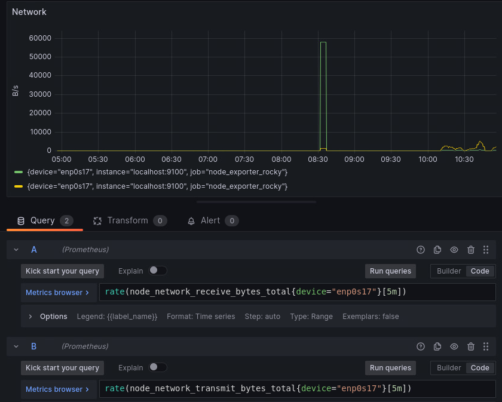
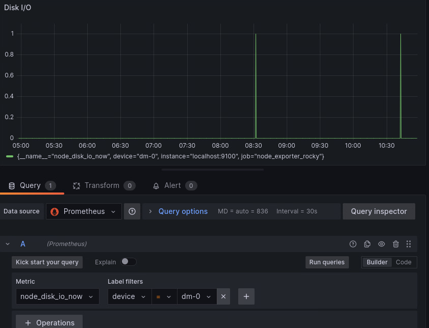

# Настройка мониторинга. Prometheus.
На развернутой ВМ уже установлен Prometheus NodeExporter Alertmanager и Grafana. 
В Grafana настроен Prometheus как Data Source

Общий вид дашборда

Параметры каждого графика

