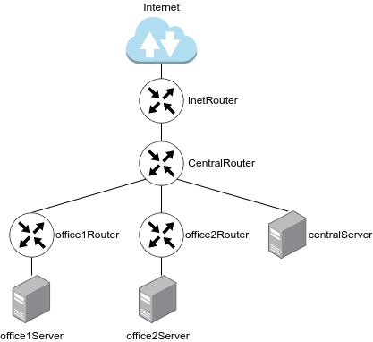
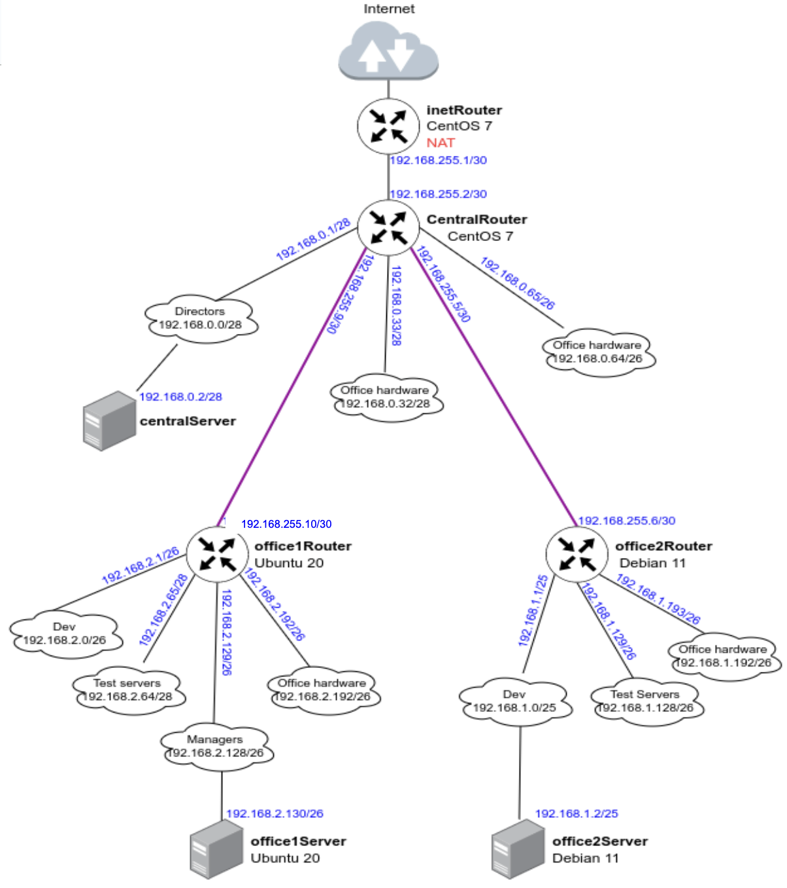

# Архитектура сетей
Задание:
1) Теоретическая часть
- Найти свободные подсети
- Посчитать сколько узлов в каждой подсети, включая свободные
- Указать broadcast адрес для каждой подсети
- проверить нет ли ошибок при разбиении
2) Практическая часть
- Соединить офисы в сеть согласно схеме и настроить роутинг
- Все сервера и роутеры должны ходить в инет черз inetRouter
- Все сервера должны видеть друг друга
- у всех новых серверов отключить дефолт на NAT, который вагрант поднимает для связи
- при нехватке сетевых интерфейсов добавить по несколько адресов на интерфейс
## Теоретическая часть
Для демонстрационного стенда развернуто 4 ВМ - 3 сервера (office1Server, office2Server, centralServer), 4 маршрутизатора (inetRouter, centralRouter, office1Router, office2Router).



Конфигурация подсетей:

| **Имя**                                | **Подсеть**      | **Маска**       | **К-во хостов**  | **Первый адрес**   | **Последний адрес**   | **Broadcast** |
| -------------------------------------- | ---------------- | --------------- | --------- | ------------------ | --------------------- | ------------- |
| **Central Network**                    |
| Directors                              | 192.168.0.0/28   | 255.255.255.240 | 14        | 192.168.0.1        | 192.168.0.14          | 192.168.0.15  |
| Office hardware                        | 192.168.0.32/28  | 255.255.255.240 | 14        | 192.168.0.33       | 192.168.0.46          | 192.168.0.47  |
| Wifi(mgt network)                      | 192.168.0.64/26  | 255.255.255.192 | 62        | 192.168.0.65       | 192.168.0.126         | 192.168.0.127 |
| **Office 1 network**                   |
| Dev                                    | 192.168.2.0/26   | 255.255.255.192 | 62        | 192.168.2.1        | 192.168.2.62          | 192.168.2.63  |
| Test                                   | 192.168.2.64/26  | 255.255.255.192 | 62        | 192.168.2.65       | 192.168.2.126         | 192.168.2.127 |
| Managers                               | 192.168.2.128/26 | 255.255.255.192 | 62        | 192.168.2.129      | 192.168.2.190         | 192.168.2.191 |
| Office hardware                        | 192.168.2.192/26 | 255.255.255.192 | 62        | 192.168.2.193      | 192.168.2.254         | 192.168.2.255 |
| **Office 2 network**                   |
| Dev                                    | 192.168.1.0/25   | 255.255.255.128 | 126       | 192.168.1.1        | 192.168.1.126         | 192.168.1.127 |
| Test                                   | 192.168.1.128/26 | 255.255.255.192 | 62        | 192.168.1.129      | 192.168.1.190         | 192.168.1.191 |
| Office                                 | 192.168.1.192/26 | 255.255.255.192 | 62        | 192.168.1.193      | 192.168.1.254         | 192.168.1.255 |
| **InetRouter — CentralRouter network** |
| Inet — central                         | 192.168.255.0/30 | 255.255.255.252 | 2         | 192.168.255.1      | 192.168.255.2         | 192.168.255.3 |

Список свободных подсетей:

- 192.168.0.16/28 
- 192.168.0.48/28
- 192.168.0.128/25
- 192.168.255.64/26
- 192.168.255.32/27
- 192.168.255.16/28
- 192.168.255.8/29  
- 192.168.255.4

Логическая топология всех представленных в таблице выше подсетей



## Практическая часть
Согласно представленной выше топологии развернуто 7 ВМ, адресация, статические маршруты везде, а также NAT на inetRouter полностью настроены. central инфраструктура развернута на базе Rocky Linux 9.2, office1 - Ubuntu 22.04, office 2 - Debian 12.

Проверим корректность работы сети, приведем трассировки с 3 серверов
```
[vagrant@centralServer ~]$ traceroute 8.8.8.8
traceroute to 8.8.8.8 (8.8.8.8), 30 hops max, 60 byte packets
 1  _gateway (192.168.0.1)  3.645 ms  3.359 ms  3.164 ms
 2  192.168.255.1 (192.168.255.1)  2.938 ms  2.713 ms  2.452 ms
 3  10.0.2.2 (10.0.2.2)  2.402 ms  2.227 ms  2.060 ms
...

vagrant@office1Server:~$ traceroute 8.8.8.8
traceroute to 8.8.8.8 (8.8.8.8), 30 hops max, 60 byte packets
 1  _gateway (192.168.2.129)  0.528 ms  0.484 ms  0.340 ms
 2  192.168.255.9 (192.168.255.9)  1.018 ms  2.160 ms  2.126 ms
 3  192.168.255.1 (192.168.255.1)  3.207 ms  3.022 ms  3.100 ms
 4  10.0.2.2 (10.0.2.2)  3.636 ms  3.503 ms  3.772 ms
...

vagrant@office2Server:~$ traceroute 8.8.8.8
traceroute to 8.8.8.8 (8.8.8.8), 30 hops max, 60 byte packets
 1  192.168.1.1 (192.168.1.1)  2.399 ms  2.217 ms  2.013 ms
 2  192.168.255.5 (192.168.255.5)  1.801 ms  1.611 ms  1.442 ms
 3  192.168.255.1 (192.168.255.1)  1.720 ms  2.081 ms  2.065 ms
 4  10.0.2.2 (10.0.2.2)  2.630 ms  3.144 ms  3.318 ms
...
```
Сеть работает корректно, трафик проходит, как задумано.

 **PROFIT!!!**
