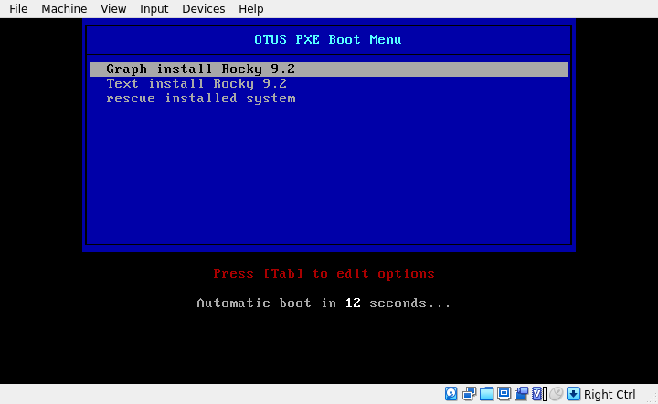
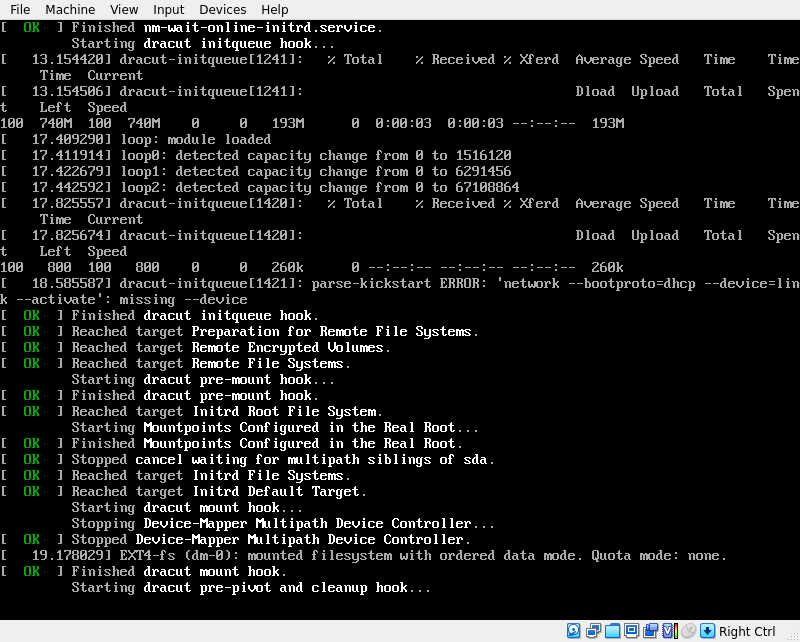
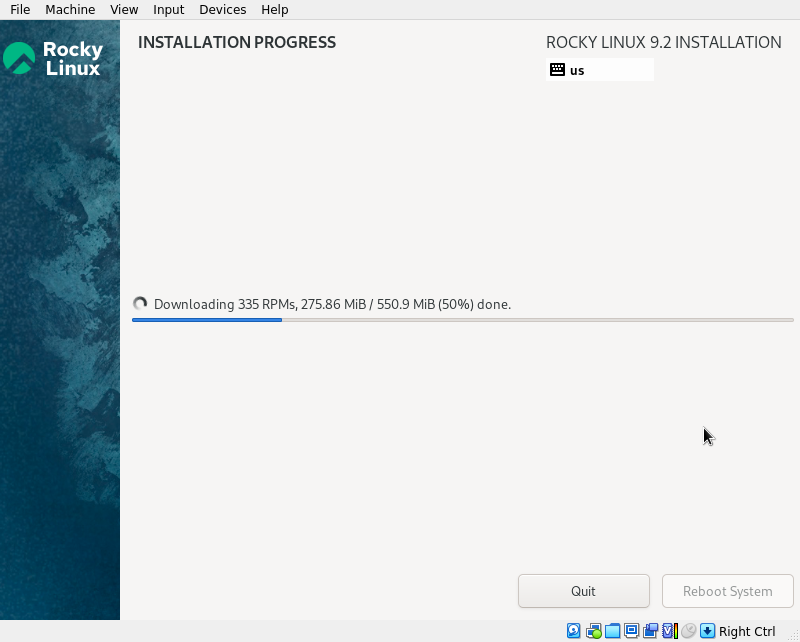
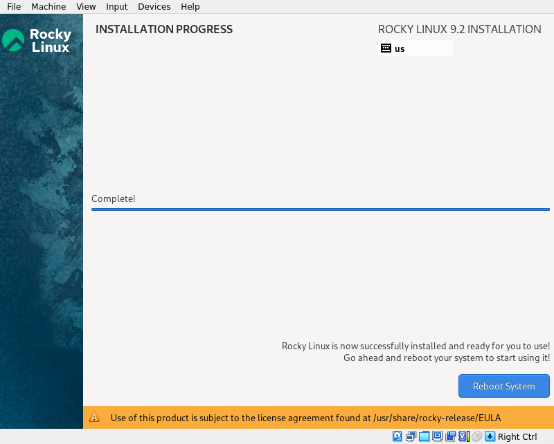

# DHCP, PXE
После развертывания PXE-сервер уже полностью готов к развертыванию ОС по сети в автоматическом режиме, клиент настроен на загрузку по сети и автоматически начнет процесс установки ОС. Ниже представлены скриншоты, иллюстрирующие процесс загрузки и установки Rocky Linux 9.2 по сети.

- Меню установки

- Загрузка установщика

- Установка ОС

- ОС установлена

После завершения установки, для загрузки установленной ОС, требуется выключить ВМ pxe-client и внести изменения в порядок загрузки (поставить приоритетом загрузку с диска). **PROFIT!!!**