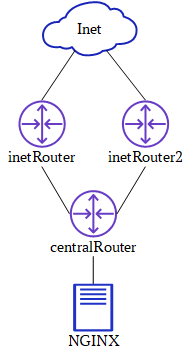

# Firewall
Для демонстрационного стенда развернуто 4 ВМ - веб-сервер (nginx), центральный маршрутизатор (centralRouter) и два маршрутизатора-межсетевых экрана (InetRouter1, InetRouter2).



Согласно условиям задания, с centralRouter, используя port-knocking, можно попасть  по SSH на inetRouter1, а порт 8080 на inetRouter2 перенаправлен на порт 80 nginx, также настроен проброс порта 8080 inetRouter2 на localhost хостовой ОС.
Проверим работу Port-knocking c `centralRouter`:
```
[vagrant@centralRouter ~]$ ssh 10.0.254.1
ssh: connect to host 10.0.254.1 port 22: No route to host
[vagrant@centralRouter ~]$ knock 10.0.254.1 2222:udp 3333:tcp 20000:udp
[vagrant@centralRouter ~]$ ssh 10.0.254.1
The authenticity of host '10.0.254.1 (10.0.254.1)' can't be established.
ED25519 key fingerprint is SHA256:7NPvz5lYyqfI0HM1Mo1FZDOKLaIsf4RZi9iPa6sNPb0.
This key is not known by any other names
Are you sure you want to continue connecting (yes/no/[fingerprint])? yes
Warning: Permanently added '10.0.254.1' (ED25519) to the list of known hosts.
vagrant@10.0.254.1's password:
...
[vagrant@InetRouter1 ~]$ 
```
Теперь посмотрим, как работает доступ к веб-серверу из внешней сети ( с хостовой ОС ) через inetRouter2.
```
[kgeor@rocky-ls lab20]$ curl 127.0.0.1:8080
<!doctype html>
<html>
  <head>
    <meta charset='utf-8'>
    <meta name='viewport' content='width=device-width, initial-scale=1'>
    <title>HTTP Server Test Page powered by: Rocky Linux</title>
...
```
Доступ к ресурсам внутри сети настроен корректно. **PROFIT!!!!**