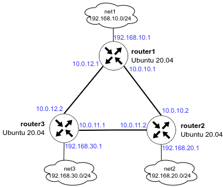

# OSPF
Топология развернутого стенда



На развернутом стенде из 3 маршрутизаторов адресация и маршрутизация уже полностью настроены согласно топологии выше.

для проверки корректности настройки просмотрим отношения смежности в интерфейсе FRR.
```
root@router3:~# vtysh
router3# sh ip ospf neighbor

Neighbor ID     Pri State           Up Time         Dead Time Address         Interface                        RXmtL RqstL DBsmL
2.2.2.2           1 Full/DR         17m31s            28.643s 10.0.11.2       enp0s8:10.0.11.1                     0     0     0
1.1.1.1           1 Full/DR         17m25s            28.643s 10.0.12.1       enp0s9:10.0.12.2                     0     0     0
```
Отношения успешно установлены между всеми маршрутизаторами, информация между ними полностью синхронизирована.

Проверим таблицы маршрутизации и проверим доступность удаленных (не directly connected) сетей.
```
root@router3:~# ip route
default via 10.0.2.2 dev enp0s3 proto dhcp src 10.0.2.15 metric 100
10.0.2.0/24 dev enp0s3 proto kernel scope link src 10.0.2.15 metric 100
10.0.2.2 dev enp0s3 proto dhcp scope link src 10.0.2.15 metric 100
10.0.2.3 dev enp0s3 proto dhcp scope link src 10.0.2.15 metric 100
10.0.10.0/30 nhid 41 proto ospf metric 20
        nexthop via 10.0.11.2 dev enp0s8 weight 1
        nexthop via 10.0.12.1 dev enp0s9 weight 1
10.0.11.0/30 dev enp0s8 proto kernel scope link src 10.0.11.1
10.0.12.0/30 dev enp0s9 proto kernel scope link src 10.0.12.2
192.168.10.0/24 nhid 42 via 10.0.12.1 dev enp0s9 proto ospf metric 20
192.168.20.0/24 nhid 34 via 10.0.11.2 dev enp0s8 proto ospf metric 20
192.168.30.0/24 dev enp0s10 proto kernel scope link src 192.168.30.1
192.168.56.0/24 dev enp0s16 proto kernel scope link src 192.168.56.12

root@router3:~# ping 192.168.10.1
PING 192.168.10.1 (192.168.10.1) 56(84) bytes of data.
64 bytes from 192.168.10.1: icmp_seq=1 ttl=64 time=0.562 ms
64 bytes from 192.168.10.1: icmp_seq=2 ttl=64 time=1.23 ms
^C
--- 192.168.10.1 ping statistics ---
2 packets transmitted, 2 received, 0% packet loss, time 1080ms
rtt min/avg/max/mdev = 0.562/0.897/1.232/0.335 ms

root@router3:~# ping 192.168.20.1
PING 192.168.20.1 (192.168.20.1) 56(84) bytes of data.
64 bytes from 192.168.20.1: icmp_seq=1 ttl=64 time=0.584 ms
64 bytes from 192.168.20.1: icmp_seq=2 ttl=64 time=0.480 ms
^C
--- 192.168.20.1 ping statistics ---
2 packets transmitted, 2 received, 0% packet loss, time 1025ms
rtt min/avg/max/mdev = 0.480/0.532/0.584/0.052 ms
```
Маршрутизация настроена корректно, трафик свободно проходит до удаленных сетей.
## Асимметричная маршрутизация
на хосте запустим плейбук с параметрами
```
ansible-playbook -i .vagrant/provisioners/ansible/inventory/vagrant_ansible_inventory -l all ansible/playbook.yml -t modify -e '{"ansible_host_key_checking": false,"default_cost": false}'
```
и проверим на роутерах 1 и 2
```
router1# show ip route ospf
Codes: K - kernel route, C - connected, S - static, R - RIP,
       O - OSPF, I - IS-IS, B - BGP, E - EIGRP, N - NHRP,
       T - Table, v - VNC, V - VNC-Direct, A - Babel, F - PBR,
       f - OpenFabric,
       > - selected route, * - FIB route, q - queued, r - rejected, b - backup
       t - trapped, o - offload failure

O   10.0.10.0/30 [110/300] via 10.0.12.2, enp0s9, weight 1, 1d09h15m
O>* 10.0.11.0/30 [110/200] via 10.0.12.2, enp0s9, weight 1, 1d09h15m
O   10.0.12.0/30 [110/100] is directly connected, enp0s9, weight 1, 1d09h16m
O   192.168.10.0/24 [110/100] is directly connected, enp0s10, weight 1, 1d09h16m
O>* 192.168.20.0/24 [110/300] via 10.0.12.2, enp0s9, weight 1, 1d09h15m
O>* 192.168.30.0/24 [110/200] via 10.0.12.2, enp0s9, weight 1, 1d09h15m
...
root@router1:~# ping -I 192.168.10.1 192.168.20.1
root@router2:~# tcpdump -i enp0s9
tcpdump: verbose output suppressed, use -v[v]... for full protocol decode
listening on enp0s9, link-type EN10MB (Ethernet), snapshot length 262144 bytes
06:57:27.058143 IP 192.168.10.1 > router2: ICMP echo request, id 1, seq 14, length 64
06:57:28.109842 IP 192.168.10.1 > router2: ICMP echo request, id 1, seq 15, length 64
06:57:29.146258 IP 192.168.10.1 > router2: ICMP echo request, id 1, seq 16, length 64
root@router2:~# tcpdump -i enp0s8
tcpdump: verbose output suppressed, use -v[v]... for full protocol decode
listening on enp0s8, link-type EN10MB (Ethernet), snapshot length 262144 bytes
06:58:00.355451 IP router2 > 192.168.10.1: ICMP echo reply, id 1, seq 45, length 64
06:58:01.400439 IP router2 > 192.168.10.1: ICMP echo reply, id 1, seq 46, length 64
06:58:02.440490 IP router2 > 192.168.10.1: ICMP echo reply, id 1, seq 47, length 64
```
на router2 трафик приходит на enp0s9, а ответный уходит c enp0s8

## Симметричная маршрутизация
на хосте запустим плейбук с параметрами
```
ansible-playbook -i .vagrant/provisioners/ansible/inventory/vagrant_ansible_inventory -l all ansible/playbook.yml -t modify -e '{"ansible_host_key_checking": false,"default_cost": false,"symmetric_routing": true}'
```
и проверим на роутерах 1 и 2
```
root@router1:~# ping -I 192.168.10.1 192.168.20.1
root@router2:~# tcpdump -i enp0s9
tcpdump: verbose output suppressed, use -v[v]... for full protocol decode
listening on enp0s9, link-type EN10MB (Ethernet), snapshot length 262144 bytes
08:02:15.111839 IP 192.168.10.1 > router2: ICMP echo request, id 2, seq 5, length 64
08:02:15.111849 IP router2 > 192.168.10.1: ICMP echo reply, id 2, seq 5, length 64
08:02:16.168843 IP 192.168.10.1 > router2: ICMP echo request, id 2, seq 6, length 64
08:02:16.168863 IP router2 > 192.168.10.1: ICMP echo reply, id 2, seq 6, length 64
08:02:17.170832 IP 192.168.10.1 > router2: ICMP echo request, id 2, seq 7, length 64
08:02:17.170854 IP router2 > 192.168.10.1: ICMP echo reply, id 2, seq 7, length 64
```
на router2 трафик теперь ходит симметрично через enp0s9
**PROFIT!!!**