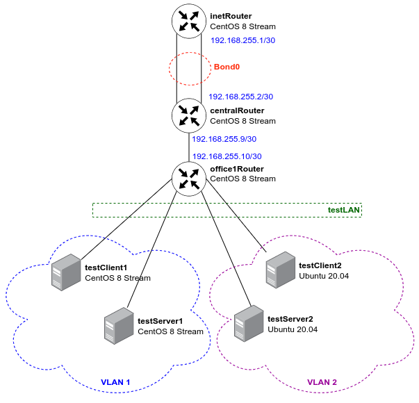

# VLAN'ы,LACP_Строим бонды и вланы
Схема сети


## 1. Настраиваем VLAN-ы
Через модуль nmcli для Rocky и через копирование yaml-файла netplan для Ubuntu были созданы сабинтерфейсы типа VLAN.
Проверим на `testClient1` 
```
[vagrant@testClient1 ~]$ ip a
...
5: vlan1@enp0s8: <BROADCAST,MULTICAST,UP,LOWER_UP> mtu 1500 qdisc noqueue state UP group default qlen 1000
    link/ether 08:00:27:f2:9f:e7 brd ff:ff:ff:ff:ff:ff
    inet 10.10.10.254/24 brd 10.10.10.255 scope global noprefixroute vlan1
       valid_lft forever preferred_lft forever
    inet6 fe80::67e2:79e1:e135:8037/64 scope link noprefixroute
       valid_lft forever preferred_lft forever
[vagrant@testClient1 ~]$ ping 10.10.10.1
PING 10.10.10.1 (10.10.10.1) 56(84) bytes of data.
64 bytes from 10.10.10.1: icmp_seq=1 ttl=64 time=0.877 ms
64 bytes from 10.10.10.1: icmp_seq=2 ttl=64 time=0.498 ms
64 bytes from 10.10.10.1: icmp_seq=3 ttl=64 time=0.482 ms
64 bytes from 10.10.10.1: icmp_seq=4 ttl=64 time=0.444 ms
^C
--- 10.10.10.1 ping statistics ---
4 packets transmitted, 4 received, 0% packet loss, time 3015ms
rtt min/avg/max/mdev = 0.444/0.575/0.877/0.175 ms
```
А теперь на `testClient2`
```
vagrant@testClient2:~$ ip a
...
5: vlan2@enp0s8: <BROADCAST,MULTICAST,UP,LOWER_UP> mtu 1500 qdisc noqueue state UP group default qlen 1000
    link/ether 08:00:27:95:8a:20 brd ff:ff:ff:ff:ff:ff
    inet 10.10.10.254/24 brd 10.10.10.255 scope global vlan2
       valid_lft forever preferred_lft forever
    inet6 fe80::a00:27ff:fe95:8a20/64 scope link
       valid_lft forever preferred_lft forever
vagrant@testClient2:~$
vagrant@testClient2:~$ ping 10.10.10.1
PING 10.10.10.1 (10.10.10.1) 56(84) bytes of data.
64 bytes from 10.10.10.1: icmp_seq=1 ttl=64 time=0.877 ms
64 bytes from 10.10.10.1: icmp_seq=2 ttl=64 time=0.599 ms
64 bytes from 10.10.10.1: icmp_seq=3 ttl=64 time=0.546 ms
64 bytes from 10.10.10.1: icmp_seq=4 ttl=64 time=0.578 ms
^C
--- 10.10.10.1 ping statistics ---
4 packets transmitted, 4 received, 0% packet loss, time 3038ms
rtt min/avg/max/mdev = 0.546/0.650/0.877/0.132 ms
```
Сабинтерфейсы подняты, связность есть, т.е. все работает корректно.
## 2. Настраиваем Bond-ы
Проверим работу бонда, откроем параллельные сессии терминала к inetRouter и centralRouter, с centralRouter запустим пинг до соседа, а на inetRouter выключим активный интерфейс бонда
```
[vagrant@centralRouter ~]$ ping 192.168.255.1
PING 192.168.255.1 (192.168.255.1) 56(84) bytes of data.
64 bytes from 192.168.255.1: icmp_seq=1 ttl=64 time=2.60 ms
64 bytes from 192.168.255.1: icmp_seq=2 ttl=64 time=0.459 ms
64 bytes from 192.168.255.1: icmp_seq=3 ttl=64 time=0.508 ms
64 bytes from 192.168.255.1: icmp_seq=4 ttl=64 time=0.455 ms
```
в этот момент на втором терминале выполняем ([root@inetRouter ~]# ip link set enp0s8 down)
```
64 bytes from 192.168.255.1: icmp_seq=5 ttl=64 time=1.11 ms
64 bytes from 192.168.255.1: icmp_seq=6 ttl=64 time=0.528 ms
64 bytes from 192.168.255.1: icmp_seq=7 ttl=64 time=0.524 ms
64 bytes from 192.168.255.1: icmp_seq=8 ttl=64 time=0.927 ms
64 bytes from 192.168.255.1: icmp_seq=9 ttl=64 time=0.533 ms
64 bytes from 192.168.255.1: icmp_seq=10 ttl=64 time=0.660 ms
64 bytes from 192.168.255.1: icmp_seq=11 ttl=64 time=0.762 ms
64 bytes from 192.168.255.1: icmp_seq=12 ttl=64 time=0.804 ms
^C
--- 192.168.255.1 ping statistics ---
12 packets transmitted, 12 received, 0% packet loss, time 11291ms
rtt min/avg/max/mdev = 0.455/0.822/2.603/0.571 ms
```
После выключения активного интерфейса мы получаем единичное увеличение времени ответа, трафик при этом не теряется, т.е. отказ активного интерфейса отработан корректно.

**PROFIT!!!**