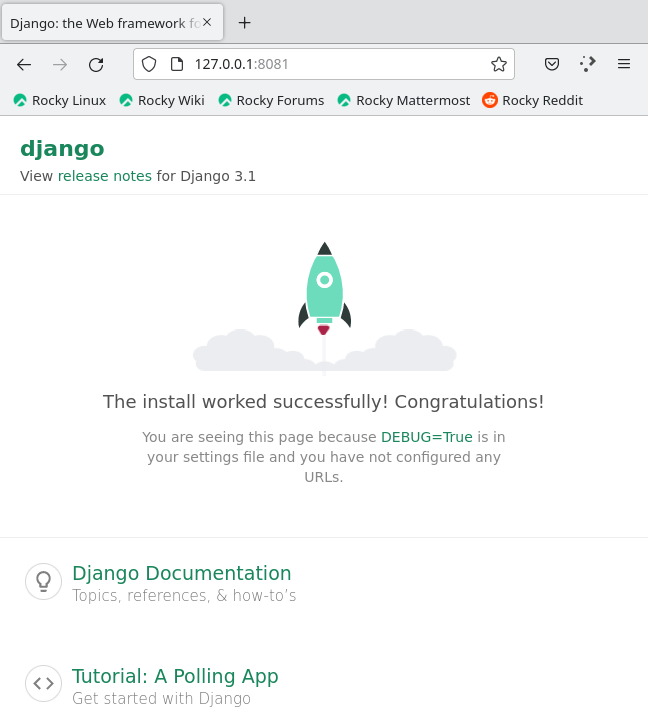
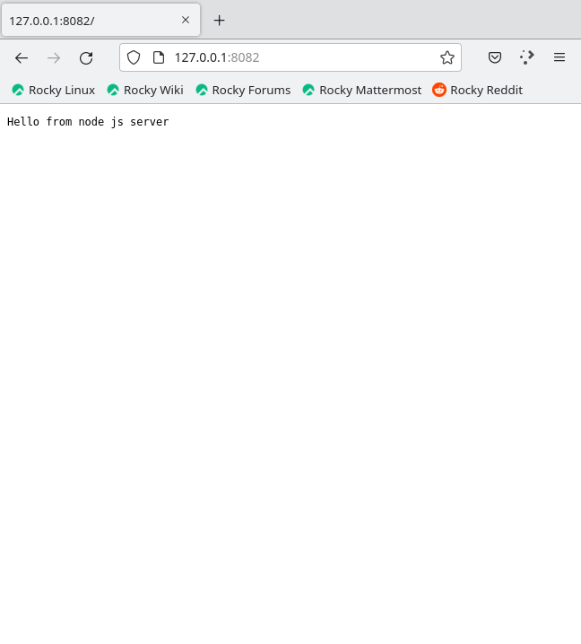
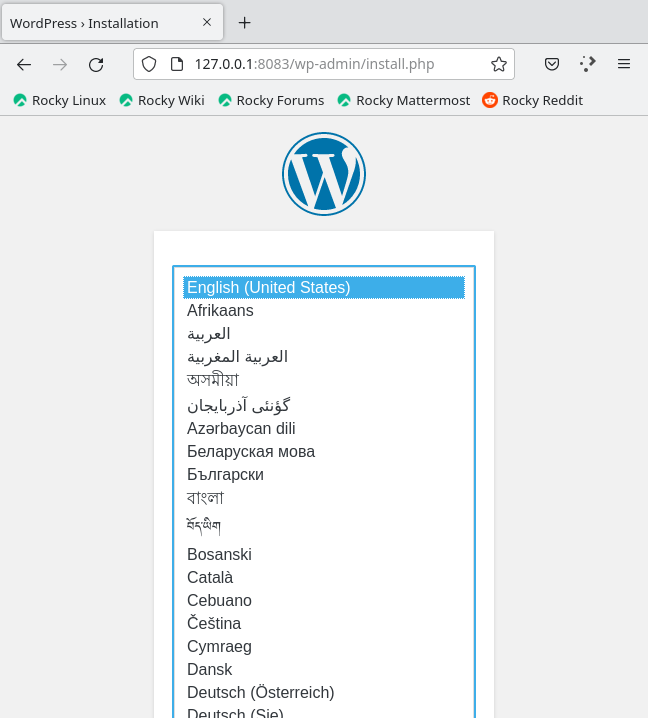

# Динамический Web
После запуска ВМ docker compose автоматом развернет стенд из контейнеров NGINX, MySQL и 3 апстрим серверов - Python (django), php-fpm (wordpress), NodeJS. 

Проверим работу каждого из веб-сервисов

Django

NodeJS

WordPress

Все сервисы корректно отдают свои веб-странички. It's seems to be OK.