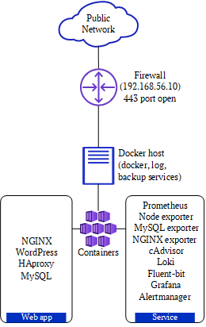
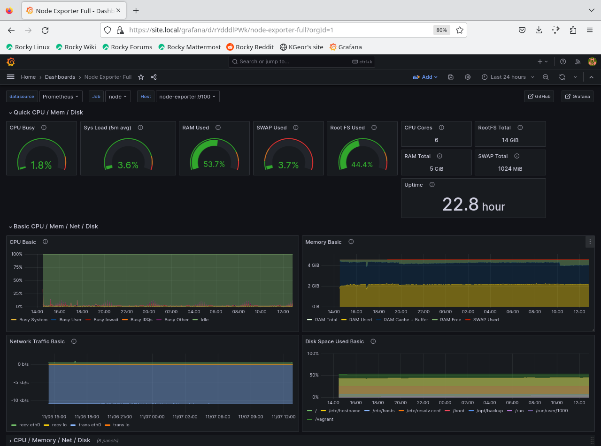
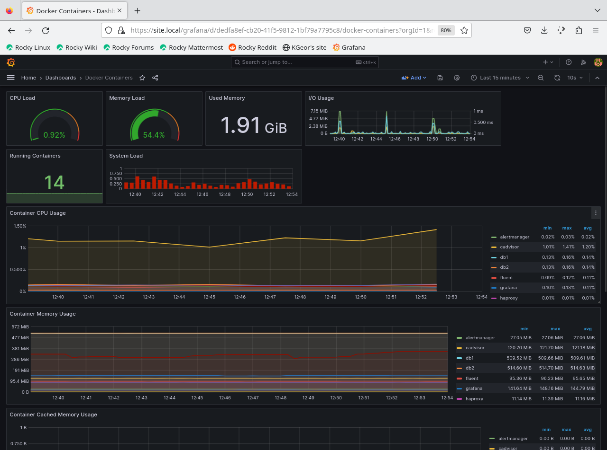
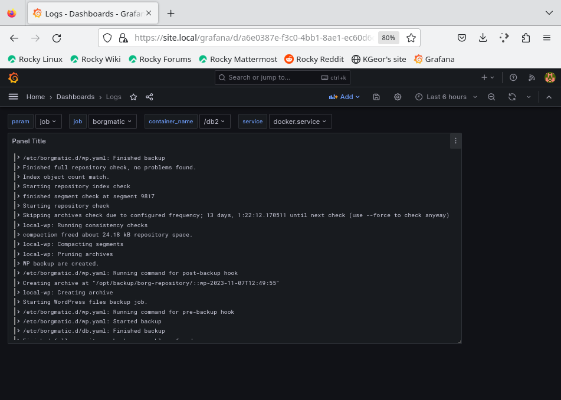

# Проект "Автоматизированное развертывание веб-приложения (WordPress) с двусторонней репликацией БД, мониторингом и резервным копированием"
## Описание
### Схема и краткое описание
ПРОЕКТ представляет собой развертывание веб-приложения (WordPress) с отказоустойчивым бэкендом (MySQL), мониторингом и резервным копированием.

Для комплексности, дополнительно развернута ВМ для выполнения функций межсетевого экрана с настроенным доступом извне только по порту веб-интерфейса WordPress (URL <site_name>) и Grafana (URL <site_name>/grafana/), прямой доступ к сервисам на ВМ Docker не предусматривается.

Основная ВМ - хост Docker с установленным docker compose, где разворачивается стенд из основных контейнеров:
- NGINX (фронтенд веб-сервер)
- 2х MySQL (СУБД)
- HAproxy (балансировщик для БД)
- php-fpm (веб-приложение WordPress).

<!--  -->
Сервисные контейнеры:
- Prometheus (сбор метрик)
- Node exporter (экспорт метрик ОС ВМ Docker)
- MySQL exporter (экспорт метрик БД)
- NGINX exporter (экспорт метрик веб-сервера)
- cAdvisor (экспорт метрик контейнеров и мониторинг Docker)
- Loki (хранение логов)
- Fluent-bit (сбор и доставка логов в Loki)
- Grafana (визуализация метрик, логов, алертов)
- Alertmanager (генерирование алертов на основе метрик)

Оба узла `MySQL` настроены для двусторонней репликации по типу Master-Master. `HAproxy` используется в качестве балансировщика (в текущей конфигурации выбирает первый доступный из бэкенд-серверов MySQL), настроена проверка работоспособности MySQL - L7 Check.

Для сбора метрик используется `Prometheus` и экспортеры - `Node MySQL NGINX`, источник данных для `Grafana`. 
Сбор логов осуществляется на базе связки `fluent-bit` (используется встроенный драйвер docker для вывода лога контейнеров на адрес fluent-bit + установлен локально на хосте для мониторинга служб (docker.service)) и `Grafana Loki` как хранилище и источник данных `Grafana`.

Система резервного копирования установлена локально на хосте и базируется на `borgmatic` - borg backup с расширенным функционалом, в частности в проекте помимо базового файлового бэкапа конфигов и файлов WordPress также используется логический бэкап MySQL и настроена отправка логов прямо в Loki.
### Дашборды мониторинга

## Подготовка к запуску
### Развертывание и инициализация ВМ
- развернуть инфраструктуру ВМ с помощью vagrant, для этого внутри папки репозитория выполнить `vagrant up`
- дождаться окончания конфигурирования и зайти на ВМ Docker `vagrant ssh docker`
- перейти в смонтированную папку с файлами проекта docker compose `cd /home/vagrant/project` (путь внутри папки на хосте - ansible/files/docker)
- при необходимости посмотреть и подправить значения переменных из файла `.env` (там в том числе задаются пароли для MySQL, Grafana), благодаря установленному `direnv` и заданной конфигурации в файле .envrc при переходе в директорию проекта, все переменные из .env автоматически экспортируются в переменные окружения (и удаляются при выходе из нее).
- для работы TLS необходимо в папку `config/nginx/certs` поместить файлы сертификата и ключа, либо сгенерировать самоподписанный сертификат `./generate_cert.sh` 
- на хосте, на котором разворачиваются ВМ для нормальной работы при проверке сайтов необходимо обеспечить корректное разрешение имен, добавить запись `echo "192.168.56.10 site.local" | sudo tee -a /etc/hosts`
- развернуть стенд `docker compose up -d`
### Развертывание и инициализация контейнеров
- дождаться запуска всех контейнеров, запустить скрипт первичной инициализации MySQL `./init_db.sh`
## Проверка 
### Общая работоспособность
- после успешного конфигурирования БД перейти на хостовой ОС по адресу `https://site.local`, по нему должен отобразиться интерфейс WordPress. Завершаем установку и заходим в консоль WordPress, чтобы убедиться в полной работоспособности. Добавим тестовую страничку, для проверки резервное копирование в дальнейшем.
- на `https://site.local/grafana/` должен быть доступен интерфейс Grafana, учетные данные  по умолчанию - `admin/pass`, во вкладке Dashboards доступны предварительно сконфигурированные дашборды для каждого типа получаемых данных, во вкладке Alerting - информация о текущих алертах.
### Резервное копирование
Для резервного копирования используется borgmatic, он установлен локально на ВМ Docker как служба systemd (т.к. изнутри контейнера некорректно работает хук для бэкапа MySQL), настроен автозапуск процесса резервного копирования по таймеру, лог пишется дополнительно в Loki (выборка по параметру job=borgmatic). 
Работает только из-под пользователя root, т.е. для обращения к нему необходимо перейти в терминальную сессию пользователя root (`sudo -i`). 

Бэкап осуществляется для:
- папка с конфигурацией проекта (/home/vagrant/project)
- volume с данными WordPress
- логический бэкап MySQL

Просмотр существующих репозиториев (один и тот же репозиторий для каждого из трех заданий резервного копирования имеет свою метку, это нужно учитывать при восстановлении) и бэкапов `borgmatic list`
восстановление данных WordPress `borgmatic extract --repository <имя_репозитория> --archive <имя_архива> --destination /`
восстановление БД `borgmatic restore --archive <имя_архива>`
### Репликация и восстановление БД
смоделируем ситуацию полного отказа одного из узлов с полной потерей его данных:
- `cd /home/vagrant/project`
- уничтожаем основной узел, например db1: `docker compose down --volumes db1`, HAproxy автоматически переключится на работу с db2
- развернем новый экземпляр: `docker compose up -d`
- проинициализируем его `/init_db.sh db1`
- жем окончания синхронизации между узлами
- HAproxy проведет проверку доступности и вернет db1 в список активных серверов бэкенда. 
- Готово!!

## Заключение
В итоге, имеем рабочее веб-приложение с резервом по БД, мониторингом и резервным копированием. Здесь описаны только основные моменты и некоторые особенности развертывания, проект не претендует на абсолютную выверенность и следование всем best practices. Автору было интересно все перечисленное ПО потрогать и собрать в работоспособную кучу, не более)))